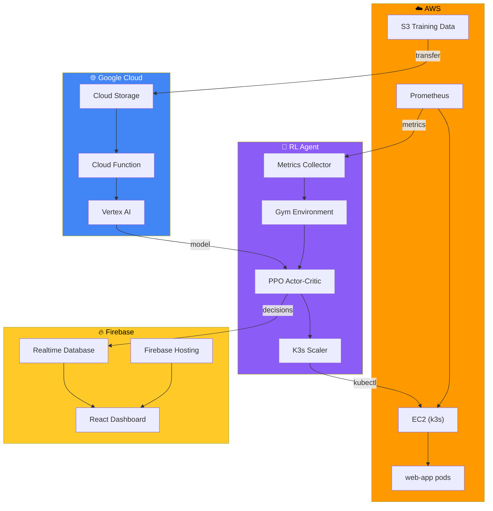

# Intelligent Predictive Autoscaler

> An RL-powered Kubernetes autoscaler with hybrid AWS/GCP infrastructure, Firebase real-time sync, and Vertex AI off-cluster training.

## Architecture



## Quick Start

### 1. Train the RL Agent (Simulation)

```bash
pip install -r requirements.txt
python -m rl_agent.agent --simulate --episodes 50
```

### 2. Run Tests

```bash
python -m pytest tests/ -v
```

### 3. Launch Dashboard

```bash
cd dashboard
npm install
npm run dev
```

### 4. Deploy Infrastructure

```bash
cd terraform
terraform init
terraform plan -var="gcp_project_id=YOUR_PROJECT"
terraform apply -var="gcp_project_id=YOUR_PROJECT"
```

## Project Structure

| Directory | Purpose |
|-----------|---------|
| `rl_agent/` | PPO agent, Gym environment, Prometheus collector, k3s scaler |
| `firebase_bridge/` | Firebase RTDB sync for real-time decision streaming |
| `terraform/` | Multi-cloud IaC (AWS + GCP + Firebase) |
| `cloud_functions/` | GCS-triggered Vertex AI retraining |
| `dashboard/` | React + Vite live dashboard on Firebase Hosting |
| `.github/workflows/` | CI/CD pipeline for multi-cloud deployment |
| `tests/` | Comprehensive test suite |

## Configuration

Copy `.env.example` and fill in your credentials:

```env
# AWS
AWS_ACCESS_KEY_ID=
AWS_SECRET_ACCESS_KEY=

# Kubernetes
K3S_API_URL=https://your-ec2-ip:6443
K3S_TOKEN=
TARGET_DEPLOYMENT=web-app
KUBECONFIG=

# Prometheus
PROMETHEUS_URL=http://your-ec2-ip:9090

# Firebase
FIREBASE_SA_PATH=firebase-service-account.json
FIREBASE_DB_URL=https://your-project.firebaseio.com
FIREBASE_PROJECT_ID=your-project-id
```

## Tech Stack

| Component | Technology |
|-----------|-----------|
| **Compute** | AWS EC2 (k3s) |
| **Brain** | Python PPO Agent (PyTorch) |
| **Metrics** | Prometheus |
| **Real-time Sync** | Firebase Realtime Database |
| **Heavy ML** | Google Vertex AI |
| **Dashboard** | React + Vite + Firebase Hosting |
| **IaC** | Terraform (multi-cloud) |
| **CI/CD** | GitHub Actions |

## License

MIT
